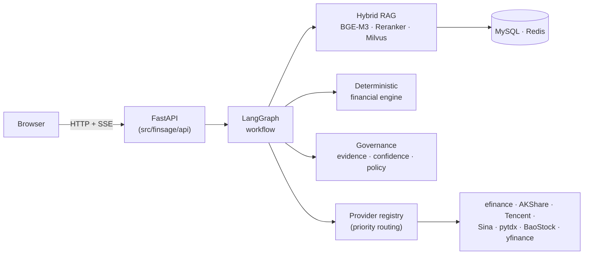

# FinSage

Financial research and question-answering platform built on **Hybrid RAG + LangGraph workflow + a deterministic financial engine**.

[](https://github.com/wigginning/FinSage/actions/workflows/ci.yml)
[](LICENSE)

> 中文版：请见 [`README.zh-CN.md`](README.zh-CN.md)

## What it is

FinSage helps you research companies. It combines five capabilities:

| Capability | What it does |
|---|---|
| **Hybrid RAG** | Retrieval over your own documents — dense + sparse via BGE-M3, reranked by BGE-Reranker-v2-M3, stored in Milvus |
| **Deterministic financial engine** | Authoritative arithmetic (growth, ratios, period comparison, unit/currency conversion). Financial numbers are computed by code, never by the LLM |
| **Proof & audit core** | Claims → evidence → citations, confidence scoring, policy gates, verification |
| **Financial data providers** | efinance, AKShare, Tencent, Sina, pytdx, BaoStock, yfinance, plus token-gated Tushare — accessed only through a provider registry |
| **SSE streaming + FinEval** | Live research progress and answers over SSE, plus a deterministic evaluation suite |

The provider registry routes requests by priority with failover and circuit breaking: free / no-token sources are tried first, while unusable ones (token-gated or SDK not installed) are demoted automatically.

### Design principles

- **Numbers come from code, not the LLM.** All financial arithmetic is deterministic Python.
- **Every claim is traceable.** Financial facts require evidence or a calculation, tied back to the source document or data.
- **No invented metrics.** Benchmark scores depend on the configured executor, so no production numbers are claimed without running it.

The full-stack engineering spec and the architecture decision records (ADRs) are internal
working documents and are not published with this repository.

## Architecture at a glance



A detailed overview and the ADR workflow live in [`docs/architecture.md`](docs/architecture.md);
business processes and per-workflow node sequences are in [`docs/workflows.md`](docs/workflows.md).

## Repository layout

```text
.
├── apps/
│   ├── api/                    # API entry kept thin (FastAPI app in src/finsage/api)
│   └── web/                    # Next.js frontend (apps/web)
├── docker/
│   └── api/Dockerfile          # API image (built from repo root)
├── docs/                       # Architecture / benchmark / security docs
├── data/
│   └── demo/                   # Demo dataset (3 E2E demo use cases)
├── migrations/                 # Alembic migrations
├── resources/models/           # Pre-downloaded models (READ-ONLY)
├── scripts/                    # init_db.py, gen_migrations.py
└── src/finsage/                # Python backend
    ├── agents/                 # LangGraph workflow graphs
    ├── api/                    # FastAPI + SSE
    ├── evaluation/             # FinEval benchmark suite
    ├── financial/              # Deterministic financial engine
    ├── governance/             # Policy / verification / confidence / audit
    ├── ingestion+retrieval/    # Document ingestion and hybrid retrieval
    ├── mcp/                    # MCP servers (search / knowledge / financial)
    ├── persistence/            # MySQL + Redis repositories
    └── providers/              # Financial data provider registry
```

## Quickstart

### Prerequisites

- Python ≥ 3.11, Node.js ≥ 18
- Docker with Docker Compose (for middleware: MySQL, Redis, Milvus, etcd, MinIO)
- Models in `resources/models/` (BGE-M3, BGE-Reranker-v2-M3, document segmentation)

### 1. Middleware (one command)

```bash
cp .env.example .env      # then edit secrets if desired
docker compose up -d      # MySQL 8, Redis, Milvus (+ etcd, MinIO)
```

Container names use the `finsage-` prefix (e.g. `finsage-mysql`).

> **Dev default credentials & ports (local development only)**
> - Host port maps for middleware follow `docker-compose.yml`: MySQL `13306`, Redis `6579`, Milvus `19730`. The compose override (`docker-compose.override.yml`) and the `.env.example` DSNs are aligned with these.
> - One-command local startup uses **default dev credentials**: MySQL `finsage/finsage_dev_pw`, MinIO `minioadmin/minioadmin`. **These are for local development only, never for any production environment** — production must inject strong random secrets via environment variables and disable/customize every default credential.

### 2. Database

```bash
python -m venv .venv && source .venv/bin/activate   # Windows: .venv\Scripts\activate
pip install -e ".[dev]"
python scripts/init_db.py   # creates database and applies Alembic migrations
```

### 3. API server

```bash
uvicorn finsage.api.app:create_app --factory --host 0.0.0.0 --port 8237
```

Interactive docs: <http://localhost:8237/docs>

### 4. Frontend

```bash
cd apps/web
npm install
cp .env.local.example .env.local
npm run dev                # → http://localhost:3000
```

### 5. Containerized deployment (frontend/backend separated)

```bash
docker compose --profile app up -d --build   # builds & starts finsage-api + finsage-web + middleware
```

- Backend API: <http://localhost:8237> (`finsage-api`)
- Frontend web: <http://localhost:3200> (`finsage-web`)
- Frontend talks to the API over HTTP + CORS (`NEXT_PUBLIC_API_BASE_URL`).

## About the demo

`data/demo/` ships three demo use cases (revenue/net-profit changes, financial-statement
anomalies, a simulated due-diligence) that drive the frontend E2E demos. See
[`data/demo/README.md`](data/demo/README.md).

## Running tests

```bash
pytest                    # backend unit + evaluation tests (root)
cd apps/web && npm test    # frontend unit/component
cd apps/web && npx playwright test   # frontend E2E (F001–F010)
```

## Quality gates

Run these alongside the tests above. The GitHub Actions workflow
(`.github/workflows/ci.yml`) runs the **backend** gates on every push/PR to `master`;
the frontend gates are currently local-only.

```bash
# Backend (root)
ruff check src tests migrations
mypy src

# Frontend
cd apps/web
npm run typecheck   # tsc --noEmit
npm run lint        # eslint .
```

## Benchmark / evaluation

The FinEval suite ships a deterministic dataset and runner. Because scoring depends on a
configured executor (workflow + models), no production benchmark numbers are claimed here.
See [`docs/benchmark.md`](docs/benchmark.md).

## Documentation

| Doc | Purpose |
|---|---|
| [`docs/architecture.md`](docs/architecture.md) | Architecture overview + decision record (ADR) workflow |
| [`docs/workflows.md`](docs/workflows.md) | Business processes: ingestion pipeline, the four LangGraph workflows, API surface |
| [`docs/benchmark.md`](docs/benchmark.md) | How FinEval works and how to run/report it (honest metrics only) |
| [`docs/security.md`](docs/security.md) | Security model and trust boundaries (§26.16 / §31.7) |
| [`SECURITY.md`](SECURITY.md) | How to report vulnerabilities and which versions are supported |
| [`CONTRIBUTING.md`](CONTRIBUTING.md) | Contribution guide |
| [`CODE_OF_CONDUCT.md`](CODE_OF_CONDUCT.md) | Community code of conduct |

## Security

- Never commit real secrets. Only `.env.example` / `.env.local.example` samples are tracked.
- API keys never ship in the client bundle.
- External document/web content is untrusted input; evidence text renders as plain text by default.
- See [`docs/security.md`](docs/security.md).

## License

This project is released under the **Apache-2.0** license. See [`LICENSE`](LICENSE).
