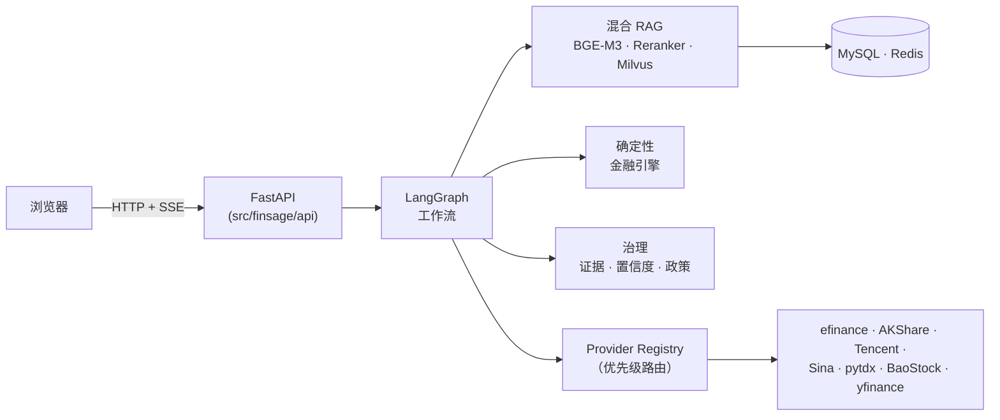

# FinSage

基于**混合 RAG + LangGraph 工作流 + 确定性金融引擎**的金融研究与问答平台。

[](https://github.com/wigginning/FinSage/actions/workflows/ci.yml)
[](LICENSE)

> English: see [`README.md`](README.md)

## 它是什么

FinSage 帮助你调研上市公司，核心由五大能力组成：

| 能力 | 说明 |
|---|---|
| **混合 RAG** | 检索自有文档——BGE-M3 稠密 + 稀疏检索，BGE-Reranker-v2-M3 重排，Milvus 存储 |
| **确定性金融引擎** | 权威的财务计算（增长率、比率、跨期对比、单位/币种换算）。财务数字由**代码**计算，绝不由 LLM 计算 |
| **证据化与审计核心** | 主张 → 证据 → 引用，含置信度评分、政策门控、核验 |
| **金融数据 Provider** | efinance / AKShare / Tencent / Sina / pytdx / BaoStock / yfinance，以及需 token 的 Tushare——仅通过 Provider Registry 访问 |
| **SSE 流式 + FinEval** | 研究进度与答案经 SSE 实时推送，并自带确定性评估套件 |

Provider Registry 按优先级路由，含故障转移与熔断：免费/无 token 源优先尝试，不可用源（需 token 或 SDK 未安装）自动降级。

### 设计原则

- **数字来自代码，不来自 LLM。** 所有财务计算均为确定性 Python 代码。
- **每个结论都可溯源。** 财务事实必须有证据或计算过程，且能回溯到来源文档或数据。
- **不编造指标。** 基准得分依赖所配置的执行器，未实际运行就不声称任何生产数值。

全栈施工规格与架构决策记录（ADR）属内部工作文档，不随本仓库公开发布。

## 架构速览



更详细的总览与 ADR 流程见 [`docs/architecture.md`](docs/architecture.md)；
业务流程与各工作流节点序列见 [`docs/workflows.md`](docs/workflows.md)。

## 仓库结构

```text
.
├── apps/
│   ├── api/                    # API 入口保持精简（FastAPI 应用位于 src/finsage/api）
│   └── web/                    # Next.js 前端（apps/web）
├── docker/
│   └── api/Dockerfile          # API 镜像（自项目根构建）
├── docs/                       # 架构 / 基准 / 安全文档
├── data/
│   └── demo/                   # 演示数据集（3 个 E2E 演示用例）
├── migrations/                 # Alembic 迁移
├── resources/models/           # 预下载模型（只读，禁止修改/覆盖）
├── scripts/                    # init_db.py、gen_migrations.py
└── src/finsage/                # Python 后端
    ├── agents/                 # LangGraph 工作流图
    ├── api/                    # FastAPI + SSE
    ├── evaluation/             # FinEval 基准套件
    ├── financial/              # 确定性金融引擎
    ├── governance/             # 政策 / 核验 / 置信度 / 审计
    ├── ingestion+retrieval/    # 文档摄取与混合检索
    ├── mcp/                    # MCP 服务（搜索 / 知识 / 金融）
    ├── persistence/            # MySQL + Redis 仓储
    └── providers/              # 金融数据 Provider Registry
```

## 快速开始

### 前置条件

- Python ≥ 3.11、Node.js ≥ 18
- Docker + Docker Compose（中间件：MySQL、Redis、Milvus、etcd、MinIO）
- `resources/models/` 中的模型（BGE-M3、BGE-Reranker-v2-M3、文档分段）

### 1. 中间件（一条命令）

```bash
cp .env.example .env      # 按需修改密钥
docker compose up -d      # MySQL 8、Redis、Milvus（+ etcd、MinIO）
```

容器名统一使用 `finsage-` 前缀（如 `finsage-mysql`）。

> **开发默认凭据与端口（仅限本地开发）**
> - 中间件宿主机端口映射以 `docker-compose.yml` 为准：MySQL `13306`、Redis `6579`、Milvus `19730`。`docker compose` 覆盖（`docker-compose.override.yml`）与 `.env.example` 的 DSN 已与此对齐。
> - 本地一键启动使用**默认开发凭据**：MySQL `finsage/finsage_dev_pw`、MinIO `minioadmin/minioadmin`。**这些仅用于本地开发，不得用于任何生产环境**——生产必须通过环境变量注入强随机口令，并关闭/改掉所有默认凭据。

### 2. 数据库

```bash
python -m venv .venv && source .venv/bin/activate   # Windows: .venv\Scripts\activate
pip install -e ".[dev]"
python scripts/init_db.py   # 建库并执行 Alembic 迁移
```

### 3. API 服务

```bash
uvicorn finsage.api.app:create_app --factory --host 0.0.0.0 --port 8237
```

交互式文档：<http://localhost:8237/docs>

### 4. 前端

```bash
cd apps/web
npm install
cp .env.local.example .env.local
npm run dev                # → http://localhost:3000
```

### 5. 容器化部署（前后端分离）

```bash
docker compose --profile app up -d --build   # 构建并启动 finsage-api + finsage-web + 中间件
```

- 后端 API：<http://localhost:8237>（`finsage-api`）
- 前端 Web：<http://localhost:3200>（`finsage-web`）
- 前端通过 HTTP + CORS 访问 API（`NEXT_PUBLIC_API_BASE_URL`）。

## 关于演示

`data/demo/` 提供三个演示用例（营收/净利润变化、财报异常、模拟尽调），驱动前端 E2E 演示。
详见 [`data/demo/README.md`](data/demo/README.md)。

## 运行测试

```bash
pytest                    # 后端单元 + 评估测试（仓库根目录）
cd apps/web && npm test    # 前端单元/组件测试
cd apps/web && npx playwright test   # 前端 E2E（F001–F010）
```

## 质量门禁

提交前需与上述测试一并跑通。GitHub Actions 工作流（`.github/workflows/ci.yml`）会在每次
push/PR 到 `master` 时执行**后端**门禁；前端门禁目前仅本地运行。

```bash
# 后端（仓库根目录）
ruff check src tests migrations
mypy src

# 前端
cd apps/web
npm run typecheck   # tsc --noEmit
npm run lint        # eslint .
```

## 基准 / 评估

FinEval 套件自带确定性数据集与 runner。由于打分依赖已配置的执行器（工作流 + 模型），本仓库**不声称任何生产基准数值**。
详见 [`docs/benchmark.md`](docs/benchmark.md)。

## 文档

| 文档 | 用途 |
|---|---|
| [`docs/architecture.md`](docs/architecture.md) | 架构总览 + 决策记录（ADR）流程 |
| [`docs/workflows.md`](docs/workflows.md) | 业务流程：文档摄取管道、四大 LangGraph 工作流、API 一览 |
| [`docs/benchmark.md`](docs/benchmark.md) | FinEval 如何工作、如何运行与上报（仅如实指标） |
| [`docs/security.md`](docs/security.md) | 安全模型与信任边界（§26.16 / §31.7） |
| [`SECURITY.md`](SECURITY.md) | 安全漏洞报告与支持版本 |
| [`CONTRIBUTING.md`](CONTRIBUTING.md) | 贡献指南 |
| [`CODE_OF_CONDUCT.md`](CODE_OF_CONDUCT.md) | 社区行为准则 |

## 安全

- 永远不要把真实密钥提交进仓库；仅 `.env.example` / `.env.local.example` 样例入库。
- API key 绝不进入客户端 bundle。
- 外部文档/网页内容是不可信输入；证据文本默认按纯文本渲染。
- 详见 [`docs/security.md`](docs/security.md)。

## 许可证

本项目以 **Apache-2.0** 发布，详见 [`LICENSE`](LICENSE)。
