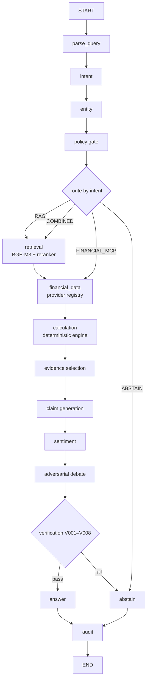

# FinSage Workflows & Business Processes

This document describes the end-to-end business processes of FinSage: how documents are
ingested, how a research question travels through the system, and what each of the four
LangGraph workflows does. Node names and routing conditions below reflect the actual graph
definitions in `src/finsage/agents/`.

## 1. Document ingestion (offline pipeline)

```text
Upload (POST /documents)
  → loader        : parse source files (incl. PDF parsing)
  → chunker       : split with the document-segmentation model
  → indexer       : embed with BGE-M3 (dense + sparse) and upsert into Milvus
  → registry      : document metadata persisted to MySQL
```

Each chunk keeps `document_id` / `chunk_id` / source metadata so that every later piece of
evidence can be traced back to its origin. Retrieval quality is protected downstream by
BGE-Reranker-v2-M3 re-ranking (see §2, step "retrieval").

## 2. Research Q&A (primary workflow, `research_qa`)

Entry: `POST /research` → a task is created, progress and results stream over
`GET /tasks/{task_id}/stream` (SSE).



Stage semantics:

| Stage | Responsibility |
|---|---|
| `parse_query` / `intent` / `entity` | Understand the question: normalize it, classify intent, resolve entities (e.g. company / ticker). |
| `policy` | Gate: out-of-scope or sensitive requests are stopped before any data is fetched. |
| `route` | Choose the data path — document retrieval (RAG), live financial data (FINANCIAL_MCP), both (COMBINED), or abstain. |
| `retrieval` | Hybrid dense + sparse search (BGE-M3) over Milvus, re-ranked by BGE-Reranker-v2-M3; emits evidence with `document_id` / `chunk_id` / source. |
| `financial_data` | Fetch market/financial data via the provider registry: priority-based routing with failover and circuit breaking; free/no-token sources first, unusable sources demoted; conflicting values are never silently ignored. |
| `calculation` | All financial arithmetic (growth, ratios, comparisons, unit/currency conversion) runs in the deterministic engine — never in the LLM. |
| `evidence` → `claim` → `sentiment` | Select supporting evidence, generate claims bound to that evidence, and add sentiment/context signals. |
| `debate` | Adversarial bull/bear debate pass to stress-test the claims before answering. |
| `verification` | Rules `V001–V008` check claims against evidence/calculations; failing claims route to `abstain`. |
| `answer` / `abstain` | Produce the grounded answer, or honestly decline when evidence/verification is insufficient. |
| `audit` | Persist an auditable record of the whole run. |

## 3. Financial health analysis (`financial_health`)

Focus: rule-driven assessment of a company's financial health.

```text
parse_query → entity → policy ─┬─ continue → financial_data → financial_rule_engine
                               │             → financial_calculation → narrative_analysis
                               │             → cross_check → claim_generation → verification
                               │                 ├─ pass   → report → audit
                               │                 └─ fail   → abstain → audit
                               └─ abstain ─────────────────────────────────────→ audit
```

The rule engine and calculation nodes are deterministic code; `narrative_analysis` and
`cross_check` layer LLM interpretation on top of already-computed numbers, and
`verification` must still pass before a report is assembled.

## 4. Due diligence (`due_diligence`)

Focus: a multi-phase simulated due-diligence review of one company. After the policy gate,
the workflow walks a fixed phase sequence, then assembles and verifies a report:

```text
POLICY ─┬─ WARMUP → COMPANY_PROFILE → BUSINESS_MODEL → FINANCIALS
        │        → COMPETITION → RISK → RED_FLAGS → FOLLOW_UP
        │        → REPORT → VERIFICATION ─┬─ pass  → AUDIT
        └─ ABSTAIN ───────────────────────┴─ fail  → ABSTAIN → AUDIT
```

Each phase reads from retrieval and/or live financial data and appends findings to the
shared state; `RED_FLAGS` collects anomalies, and the final `VERIFICATION` step applies the
same V001–V008 rules before anything is released.

## 5. Report assembly (`report`)

Focus: turn a completed research run into a structured, verified report.

```text
load_research_run → load_evidence → load_calculations → assemble_claims
  → generate_sections → verify_sections ─┬─ pass → assemble_report → audit
                                         └─ fail → abstain → audit
```

Sections are generated from previously loaded evidence and calculations (with citations),
then verified; a failed verification leads to abstention rather than an unverifiable report.

## 6. API surface

| Method & path | Purpose |
|---|---|
| `POST /research` | Submit a research task (primary workflow entry). |
| `POST /chat` | Conversational entry backed by the same research machinery. |
| `GET /tasks` · `GET /tasks/{task_id}` | List / inspect tasks. |
| `GET /tasks/{task_id}/stream` | SSE stream: `task.*`, `agent.started\|completed`, `financial_data.*`, `answer.*`, `error`. |
| `POST /tasks/{task_id}/abort` | Abort a running task. |
| `POST /documents` · `GET /documents` · `GET /documents/{document_id}` | Upload / list / inspect documents (ingestion entry). |
| `GET /evidence/{evidence_id}` | Fetch evidence by id (traceability). |
| `GET /audit/{trace_id}` | Fetch the audit record of a run. |
| `GET /companies` · `GET /companies/{ticker}` | Company directory / profile via the provider registry. |
| `GET /stats` | Aggregate statistics. |
| `POST /login` | Identity token issuance. |

Request/response shapes are defined by Pydantic models exposed through OpenAPI; errors use
the stable `FIN-XXXX` code scheme.

## 7. Cross-cutting guarantees

- **Checkpointing**: workflow graphs are compiled with a checkpointer so runs can be
  resumed instead of restarted.
- **Verification & confidence**: every claim carries a six-factor confidence score and must
  pass rules V001–V008.
- **Abstention as a first-class outcome**: all four workflows can end in `abstain` — the
  system says "insufficient evidence" rather than inventing an answer.
- **Audit**: every run writes an auditable trace, retrievable via `GET /audit/{trace_id}`.
- **Honest metrics**: benchmark results are produced by the FinEval suite
  (see [`benchmark.md`](benchmark.md)); no production numbers are claimed without running it.
