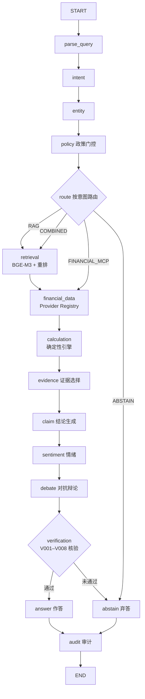

# FinSage 工作流与业务流程

> English: see [`workflows.md`](workflows.md)

本文档描述 FinSage 的端到端业务流程：文档如何被摄取、一个研究问题如何流经系统、四张 LangGraph 工作流各自做什么。下文节点名与路由条件均与 `src/finsage/agents/` 中的真实图定义一致。

## 1. 文档摄取（离线管道）

```text
上传（POST /documents）
  → loader        : 解析源文件（含 PDF 解析）
  → chunker       : 使用文档分段模型切分
  → indexer       : 以 BGE-M3 嵌入（稠密 + 稀疏）并写入 Milvus
  → registry      : 文档元数据持久化到 MySQL
```

每个 chunk 保留 `document_id` / `chunk_id` / 来源元数据，因此后续每一份证据都能回溯到原始出处。检索质量在下游由 BGE-Reranker-v2-M3 重排保障（见 §2 的「retrieval」步骤）。

## 2. 研究问答（主工作流，`research_qa`）

入口：`POST /research` → 创建任务，进度与结果经 `GET /tasks/{task_id}/stream`（SSE）推送。



各阶段职责：

| 阶段 | 职责 |
|---|---|
| `parse_query` / `intent` / `entity` | 理解问题：归一化、意图分类、实体消解（如公司 / 股票代码）。 |
| `policy` | 门控：越权或敏感请求在任何数据获取之前被拦截。 |
| `route` | 选择数据路径——文档检索（RAG）、实时金融数据（FINANCIAL_MCP）、两者兼顾（COMBINED）或弃答（ABSTAIN）。 |
| `retrieval` | 对 Milvus 做 BGE-M3 稠密 + 稀疏混合检索，BGE-Reranker-v2-M3 重排；产出携带 `document_id` / `chunk_id` / 来源的证据。 |
| `financial_data` | 经 Provider Registry 获取行情/财务数据：按优先级路由，含故障转移与熔断；免费/无 token 源优先，不可用源自动降级；多源数值冲突绝不静默忽略。 |
| `calculation` | 全部财务算术（增长、比率、对比、单位/币种换算）在确定性引擎中运行——绝不在 LLM 中进行。 |
| `evidence` → `claim` → `sentiment` | 选择支撑证据、生成与证据绑定的结论、叠加情绪/上下文信号。 |
| `debate` | 多空对抗辩论，在作答前对结论做压力测试。 |
| `verification` | 规则 V001–V008 校验结论与证据/计算的一致性；未通过的结论转入 `abstain`。 |
| `answer` / `abstain` | 产出有据可依的回答；证据或核验不足时诚实地拒绝作答。 |
| `audit` | 将整次运行写入可审计记录。 |

## 3. 财务健康分析（`financial_health`）

聚焦：以规则驱动的公司财务健康度评估。

```text
parse_query → entity → policy ─┬─ 通过 → financial_data → financial_rule_engine
                               │        → financial_calculation → narrative_analysis
                               │        → cross_check → claim_generation → verification
                               │            ├─ 通过  → report → audit
                               │            └─ 未通过 → abstain → audit
                               └─ 拦截 ────────────────────────────────→ audit
```

规则引擎与计算节点为确定性代码；`narrative_analysis` 与 `cross_check` 在已算出的数字之上叠加 LLM 解读，且最终仍须通过 `verification` 才能组装报告。

## 4. 尽职调查（`due_diligence`）

聚焦：对一家公司做多阶段模拟尽调。通过政策门控后，工作流按固定阶段序列推进，再组装并核验报告：

```text
POLICY ─┬─ WARMUP → COMPANY_PROFILE → BUSINESS_MODEL → FINANCIALS
        │        → COMPETITION → RISK → RED_FLAGS → FOLLOW_UP
        │        → REPORT → VERIFICATION ─┬─ 通过 → AUDIT
        └─ ABSTAIN ───────────────────────┴─ 未通过 → ABSTAIN → AUDIT
```

每个阶段从检索和/或实时金融数据读取信息，把发现追加到共享状态；`RED_FLAGS` 收集异常信号，最终 `VERIFICATION` 仍执行同一套 V001–V008 规则后才放行。

## 5. 报告组装（`report`）

聚焦：把一次已完成的研究运行转化为结构化、经核验的报告。

```text
load_research_run → load_evidence → load_calculations → assemble_claims
  → generate_sections → verify_sections ─┬─ 通过 → assemble_report → audit
                                         └─ 未通过 → abstain → audit
```

各章节基于先前加载的证据与计算生成（带引用），随后核验；核验失败即弃答，不会产出无法证实报告。

## 6. API 一览

| 方法与路径 | 用途 |
|---|---|
| `POST /research` | 提交研究任务（主工作流入口）。 |
| `POST /chat` | 对话入口，底层复用同一套研究机制。 |
| `GET /tasks` · `GET /tasks/{task_id}` | 任务列表 / 详情。 |
| `GET /tasks/{task_id}/stream` | SSE 流：`task.*`、`agent.started\|completed`、`financial_data.*`、`answer.*`、`error`。 |
| `POST /tasks/{task_id}/abort` | 中止运行中的任务。 |
| `POST /documents` · `GET /documents` · `GET /documents/{document_id}` | 上传 / 列表 / 详情（摄取入口）。 |
| `GET /evidence/{evidence_id}` | 按编号获取证据（可溯源）。 |
| `GET /audit/{trace_id}` | 获取一次运行的审计记录。 |
| `GET /companies` · `GET /companies/{ticker}` | 公司目录 / 详情（经 Provider Registry）。 |
| `GET /stats` | 聚合统计。 |
| `POST /login` | 签发身份令牌。 |

请求/响应结构由 Pydantic 模型经 OpenAPI 定义；错误使用稳定的 `FIN-XXXX` 编码方案。

## 7. 跨切面保证

- **检查点**：工作流图以 checkpointer 编译，运行可恢复而非重跑。
- **核验与置信度**：每个结论携带六因子置信度评分，且必须通过 V001–V008 规则。
- **弃答是一等公民**：四张工作流都能以 `abstain` 结束——系统宁可说「证据不足」，也不编造答案。
- **审计**：每次运行写入可审计轨迹，可经 `GET /audit/{trace_id}` 获取。
- **指标诚实**：基准结果由 FinEval 套件产出（见[`benchmark.zh-CN.md`](benchmark.zh-CN.md)）；未实际运行就绝不声称任何生产数值。
